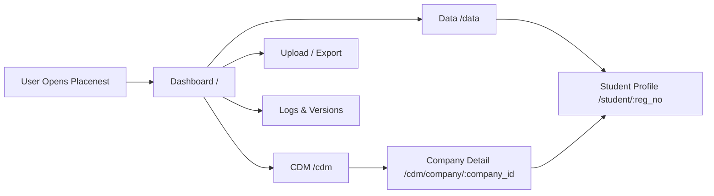
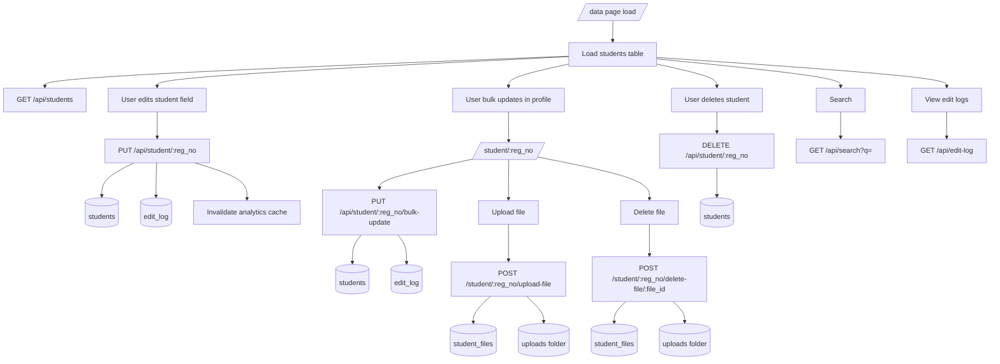
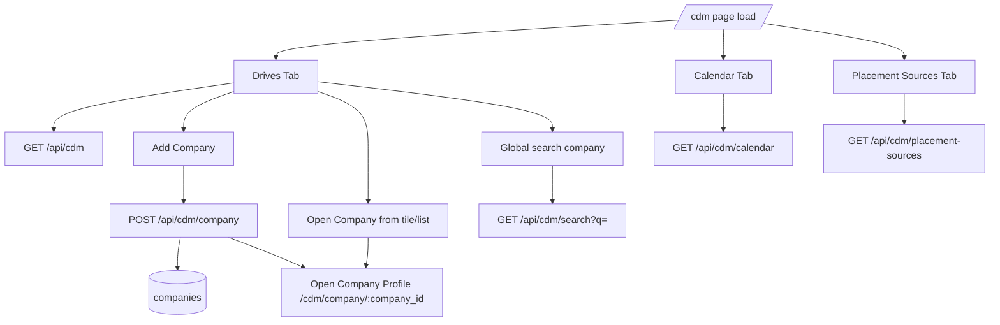
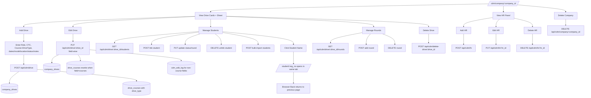
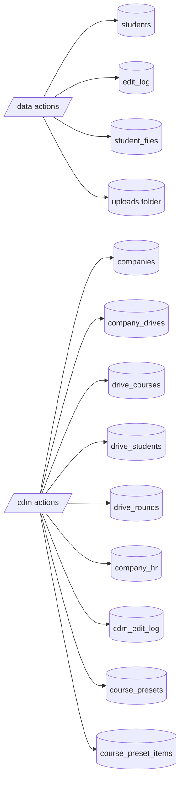
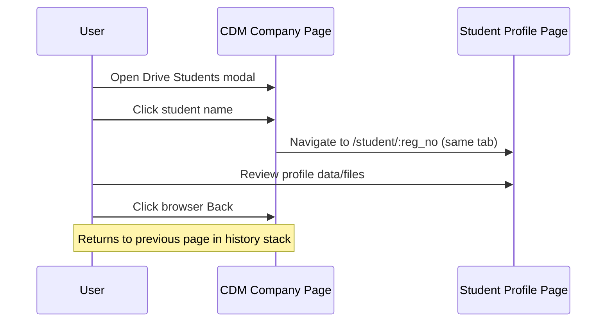

# Placenest — Mermaid User Flow (/data and /cdm)

This file provides visual user-flow diagrams for both modules.

## 1) Global Navigation

## 2) /data Detailed Flow

## 3) /cdm Main Flow

## 4) Company Detail Flow (/cdm/company/:company_id)

## 5) Persistence Map

## 6) Same-tab Student Navigation (Sequence)

